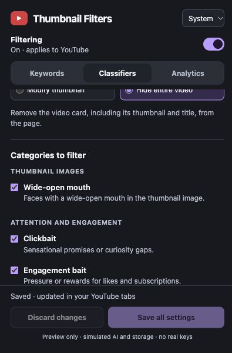

# Validation — YouTube Thumbnail Filters — Decisions

Validation date: October 6, 2026. Current release: 1.1.0.

## Build and automated checks

- `npm test`: 267 tests passed; no failures, cancellations, or skipped tests.
- `npm run build`: succeeded. Output: `/Users/ivancampos/Code/chrome-ext-dec/dist/youtube-decisions-thumbnail-filters`.
- `npm run audit:payload`: succeeded, offline. Title-only serialized character counts: 462 (1 category), 4,831 (12 categories), 8,330 (21 categories). The 21-question payload is 17.6% shorter than its previous 10,115-character representation. These are not billed-token counts.
- Node 25.4.0 and npm 11.7.0. Dependencies were copied from the existing extension's installed modules; the renamed lockfile preserves its jsdom version. No network dependency install was needed for these checks.
- Manifest target: Chrome Manifest V3; declared minimum Chrome version 111. Permission: `storage`. Host access: `api.openai.com`, `*.ytimg.com`, and `img.youtube.com`. Content scripts retain the original YouTube host/frame scope. No native targets, capabilities, or entitlements.
- Build validates JavaScript syntax, permissions, and manifest resources, and packages extension sources only. Tests, preview scripts, documentation, and verification screenshots are excluded.

## Version 1.1.0 cost optimization validation

- Full release check: `npm run check` passed all 267 tests and built the unpacked extension. `npm run audit:payload` passed. Dependency versions remain identical to the source extension; only project metadata changed.
- The focused six-category migration runs once. Action, threshold, credentials, keywords, and later selections survive. Presets, early-exit, size, and detail controls participate in Save/Discard and classifier draft indicators.
- Tests cover independent 30-day/seven-day TTLs, separate 5,000-entry LRU capacities, the combined 4 MiB serialized budget including metadata/aliases, instruction compatibility, credential ownership, restart persistence, and one-hour URL verification. Raw URLs, titles, images, and keys are absent from cache payloads.
- Shared questions coalesce across titles, thumbnails, tabs, and decoded-content identities. Both execution pools stay at two. A dispatch-time cache check prevents repeat payment after another job completes; cancellation removes unneeded questions without losing shared interest. Paid accounting remains once per dispatched request.
- Visibility tests require a visible document, 25% observer ratio plus current geometry, and continuous 300 ms dwell. Hidden/removed/recycled cards cannot cause stale paid dispatch or receive stale results.
- Valid partial answers survive malformed/refused siblings. Only unresolved questions retry; per-question cooldowns survive restart and credential rotation. Other evidence remains usable. No incomplete normal decision or fabricated mouth score filters content.
- Hide-only early exit skips image work following a title match and reports evaluated/skipped IDs. Pattern evaluated/qualified counts omit skipped categories. Style/threshold/early-exit changes reconsider incomplete decisions; complete compatible evidence can immediately recompute display behavior.
- Native browser processing: all 27 cases passed on the three supplied screenshots, using PNG, JPEG, and WebP at Original/768/512 sizes. Originals retain dimensions; smaller profiles preserve aspect ratio without enlargement. Decoded fingerprints remain stable across profiles, while cache identities also include the upload dimensions and profile. This verifies processing, not mouth-classification accuracy. Existing AVIF conversion, size, cleanup, and error regressions remain covered.
- Offline popup inspection verified Focused, early-exit enabled, Original/High defaults, draft behavior, and image-detail saving. The preview uses simulated storage and no real API key. No paid API benchmark, real-image model classification, or production Chrome reload was performed for this release.

## Features and regression coverage

All 21 original title rubrics retain their original rubric fingerprint. Existing keyword matching, settings drafts/themes, independent actions, threshold handling, styles/labels, hover suppression, recycled-card cancellation, worker concurrency, persistent caching, billing history, pattern charts/tables, and time-zone/retention behavior pass their carried-over regression tests.

The Decisions tests cover the named predicate array, title-only and inline image requests, response order, missing/duplicate/unexpected names, refusals and invalid metrics, HTTPS image URL validation, redirect/credential restrictions, supported response types, bounded streamed bodies, opt-in uploads, separate title/image caches, changed-image keys, restart reuse, cancellation during image preparation, and failed-download recovery without global blocking. AVIF regression tests verify conversion at a `.jpg` URL, preservation of 720×404 dimensions, decoded-bitmap cleanup, decoded-size limits, safe decode errors, and useful HTTP error messages without credential/URL leakage. Mocked mouth matches hide the whole card; ordinary matches remain visible; pause/deselection restores it. A test loads content scripts in the actual manifest order and drives the real worker through image download, inline upload, hide, and restoration.

Spending uses the Decisions-specific input-only rate, including the long-context boundary, with output free. Missing usage is unresolved and unknown models are unpriced. No billing attempt is created for an image download that fails before API dispatch.

## Browser inspection

Inspected the production popup in the Codex in-app browser, using the local preview's simulated storage/API. Earlier version 1.0.0 inspection confirmed the Decisions text, the then unchecked-by-default Wide-open mouth control, Hide entire video, and saving the new selection. The simulated save left the mouth control checked and Save/Discard disabled.

Native Chrome inspection of the installed extension confirmed that Wide-open mouth was selected, the saved threshold was 90%, and the saved action was Blur. The popup reported a thumbnail-loading failure. The public Batman thumbnail returned HTTP 200 with `Content-Type: image/avif` at its `.jpg` URL (21,167 bytes); the original loader reproduced an Unsupported thumbnail response error. Version 1.0.1 decodes AVIF to supported PNG, was reloaded in the existing Chrome installation, and the YouTube page refreshed. The live popup subsequently reported Connected. No saved API key was inspected or exported.

## Checklist applicability

- Chrome: Manifest V3, limited permissions, key-free public settings, no API key in image requests, and no hardcoded production secrets verified.
- SwiftUI/RealityKit items (`RealityView`, `ARView`, gesture components, mesh helpers, `@MainActor`, and update closures): not applicable; this is a JavaScript Chrome extension.
- USDZ/Blender archive, material, geometry, compression, `usdchecker`, and Vision Pro checks: not applicable; no 3D assets are created or modified.
- Live connection: the existing installed extension reported Connected after the AVIF fix. `OPENAI_API_KEY` remains unavailable in the CLI; no saved key was inspected, exported, or copied.
- Real model accuracy, per-example returned mouth probabilities, thumbnail false positives/negatives, loading latency, and incurred API cost have not been benchmarked. Automated regression tests use mocked HTTP/Chrome APIs. The three supplied images visually meet the intended rubric; their individual API scores have not been measured.

## Manual verification checklist

1. Load the built directory through Chrome's **Load unpacked**, refresh YouTube, save an OpenAI key with Decisions access, and use **Test saved key**.
2. Enable AI, select **Wide-open mouth**, and choose **Hide entire video**. Deselect title categories for a mouth-only filter. Compare exaggerated open mouths, ordinary smiles, closed mouths, and thumbnails without faces at 90% and adjusted thresholds.
3. Check Home, search, subscriptions, channels, Shorts listings, playlists, recommendations, end-screen suggestions, scrolling, and in-page navigation. Confirm old image responses cannot affect recycled cards.
4. Change styles, colors, and thresholds; pause/deselect the image filter; confirm restoration, working links, and independent keyword filtering.
5. Inspect Analytics and Filtering patterns, cache reuse after restarting Chrome, and connection/errors at `chrome://extensions`. Verify thumbnail downloads/cache hits do not add API attempts.

## Assumptions and limits

- Create a separate extension in the requested `chrome-ext-dec` workspace; leave `chrome-ext` intact.
- Preserve the 21 default title selections, with the new image upload/check explicitly opt-in.
- Use the documented Decisions model `gpt-6-luna`, named predicates, and current Decisions pricing.
- Use the existing shared classifier action and threshold for the image category. Selecting only the mouth category and Hide entire video provides mouth-only hiding.
- Only supported static thumbnail image sources can receive an image score. A missing source does not invent a negative mouth result.
- Exact thumbnail URLs identify image caches for 24 hours. Replacing bytes at the same URL can reuse the earlier score until expiration.
- This is a personal bring-your-own-key extension; live verification requires the user's OpenAI key and Chrome installation.
